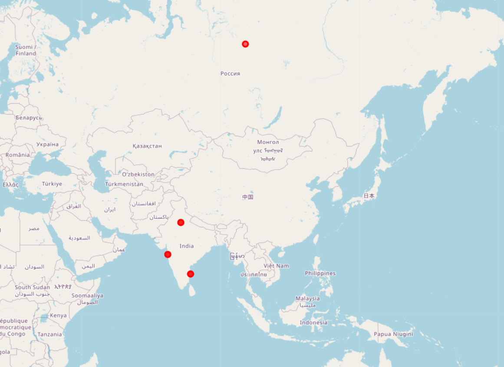
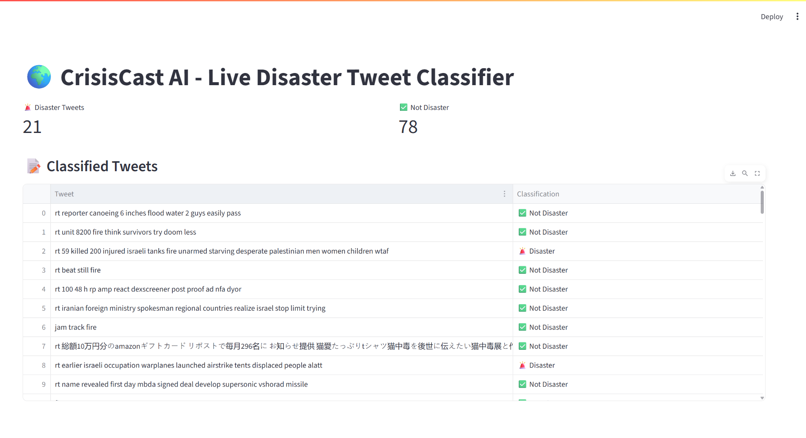

# 🌍 CrisisCast AI

> Real-Time Disaster Tweet Detection and Geo-Analysis System  
> 📅 Built: June 2025  
⚙️Skills:

• EDA • NLP • Machine Learning • Streamlit • GeoMapping

---

## 🚨 Overview

**CrisisCast AI** is a real-time intelligent system that classifies tweets related to disasters (e.g., earthquakes, floods, wildfires), maps geo-tagged tweets, and visualizes them on an interactive dashboard.

🔍 It uses:
- Machine Learning for binary disaster classification
- NLP techniques for preprocessing and sentiment cues
- Geo-mapping with `folium` for spatial analysis
- Streamlit for a live, interactive web dashboard

---

## 📦 Features

- ✅ **Real-time tweet ingestion & cleaning**
- 🔎 **ML-based disaster classification (TF-IDF + Logistic Regression)**
- 🌍 **Geo-mapping of disaster-tagged tweets**
- 📊 **Live dashboard using Streamlit**
- 💾 **Model & vectorizer saving with `.pkl` files**

---

## 🛠️ Tech Stack

| Layer              | Tools / Libraries                            |
|-------------------|-----------------------------------------------|
| Language           | Python 3.10+                                  |
| Data Processing    | pandas, re, emoji                             |
| Machine Learning   | scikit-learn (Logistic Regression, TF-IDF)    |
| Visualization      | Matplotlib, Seaborn, Folium, Streamlit        |
| Deployment         | Git, GitHub, VS Code, Docker (optional)       |

---

## 🚀 Quick Start

```bash
# Clone the repo
git clone https://github.com/Samartha21BRS1698/CrisisCast-AI.git
cd CrisisCast-AI

# Create virtual environment
python -m venv venv
venv\Scripts\activate

# Install requirements
pip install -r requirements.txt

# Run tweet collector
python collect_tweets.py

# Clean the tweet dataset
python preprocess_tweets.py
python eda_tweets.py

# Run ML training
python train_disaster_classifier.py

# Classify live tweets
python classify_live_tweets.py

# Launch dashboard
streamlit run dashboard.py
```

| Map View                        | Dashboard                           |
| -----------------------------   | ----------------------------------- |
|  | 

🧠 ML Model Performance
Algorithm: Logistic Regression

Vectorizer: TF-IDF

Accuracy: ~0.85 on test set

Evaluation: Confusion matrix, precision, recall


Confusion Matrix


📁 Project Structure

CrisisCast-AI/
│
├── collect_tweets.py            # Live tweet fetcher
├── eda_tweets.py                # Exploratory data analysis
├── train_disaster_classifier.py # Model training
├── classify_live_tweets.py      # Predict disaster tweets
├── map_geo_tweets.py            # Geolocation visualization
├── dashboard.py                 # Streamlit dashboard
├── cleaned_tweets.csv           # Cleaned tweet output
├── classified_tweets.csv        # Final predictions
├── disaster_model.pkl           # Trained ML model
├── vectorizer.pkl               # TF-IDF vectorizer
├── .env                         
├── .gitignore
└── README.md


## 🙌 Author

**Samartha**  
B.Tech student 
🎓 AI/ML • Data Science •  NLP • Google Cloud 
🔗 [LinkedIn](https://www.linkedin.com/in/samartha-b0154a293) | [GitHub](https://github.com/Samartha21BRS1698)

📝 License
 MIT License © 2025 Samartha